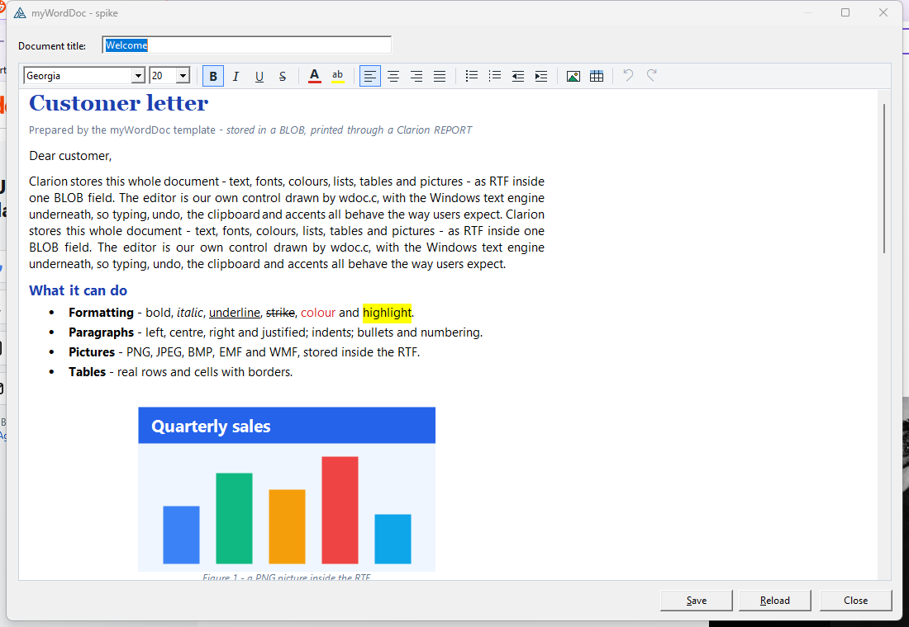
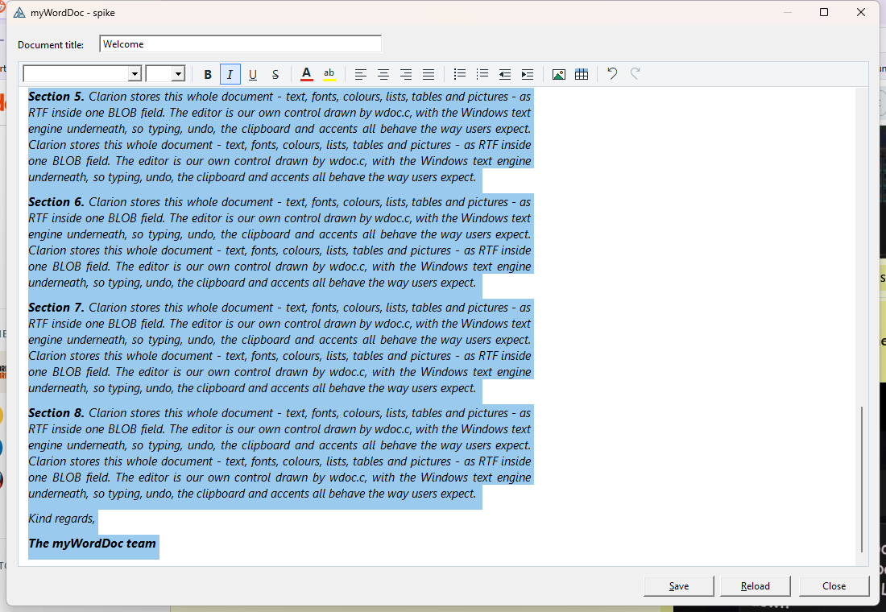
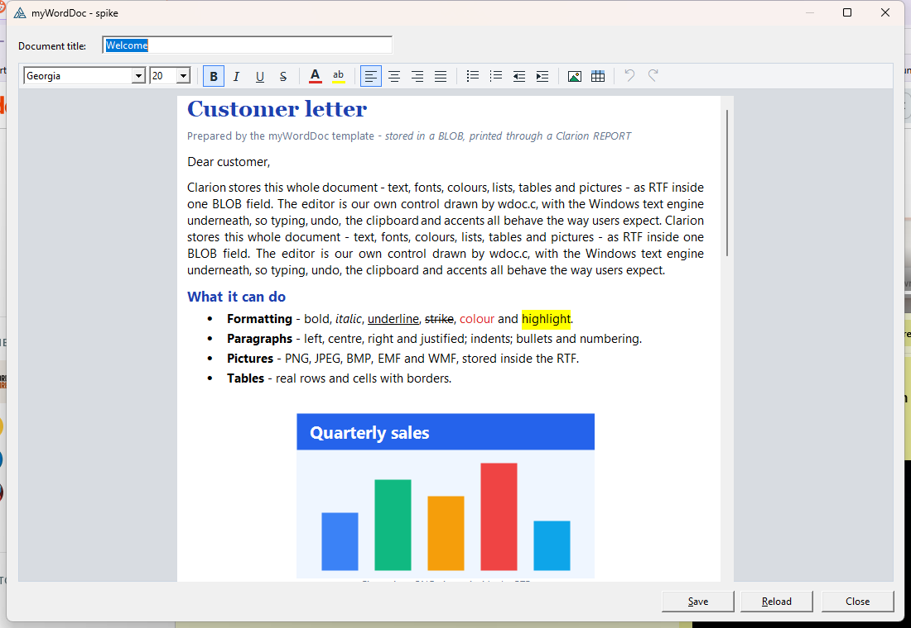
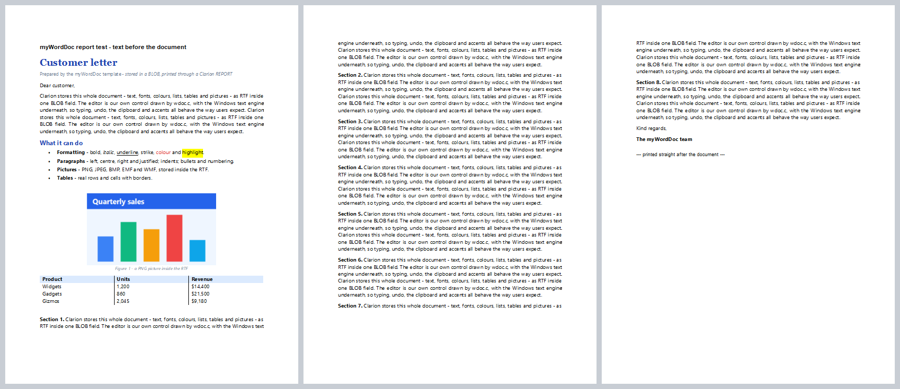
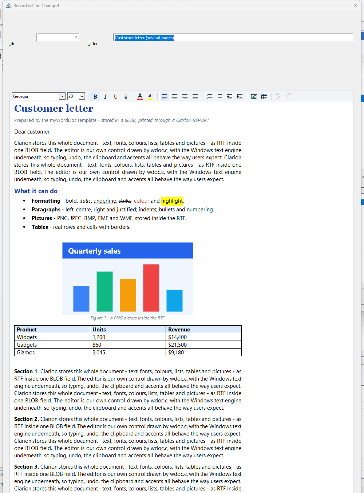
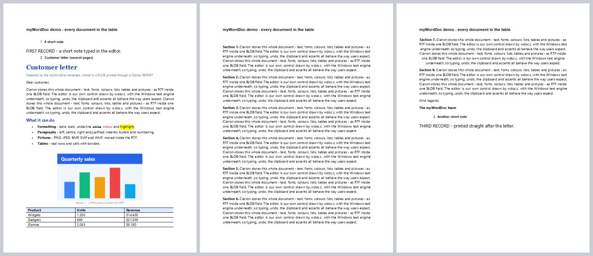

# myWordDoc

A **word processor for Clarion**, stored in a **BLOB**, that also **prints through
a Clarion REPORT**. Text, fonts, sizes, bold/italic/underline/strike, colour,
highlight, alignment, bullets, numbering, indents, pictures and tables. No COM,
no OCX, no DLL to ship.



## What it is

Our own control. `wdoc.c` registers a window class of its own (`myWordDocHost`)
whose window procedure lives in that file. The host paints its own toolbar,
handles its own buttons, colour picker, picture and table pickers, and holds the
editing surface.

The editing surface is the Windows text engine (`RICHEDIT50W` in `msftedit.dll`,
the engine behind WordPad), used as a component: it does the typing, line
breaking, selection, undo, the clipboard, accents and IME, and reads and writes
RTF. Because the host is its **parent**, every RichEdit notification comes to
*our* window procedure. The Clarion window is never subclassed.

`wdoc.c` is compiled into your executable by **Clarion's own C compiler**
(`PRAGMA('compile(wdoc.c)')` in `WordDocClass.clw`). Every Win32 call is bound
with `LoadLibrary`/`GetProcAddress`, so there is no import library and nothing
to install: `msftedit.dll` ships with every Windows since XP SP1.

| File | What it is |
|---|---|
| `wdoc.c` | the control: host window, toolbar, RichEdit, RTF streaming, pictures, tables, pagination, metafile rendering |
| `WordDocClass.inc` / `.clw` | the Clarion class: placement over a REGION, BLOB load/save, formatting API, report printing |
| `WordDocTools.inc` / `.clw` | the RTF tool classes: search/replace, fonts, plain text, HTML, Markdown, mail merge |
| `myWordDoc.tpl` | the AppGen templates (editor control, report extension, print code template) |

Copy the five source files to `accessory\libsrc\win` and the `.tpl` to
`accessory\template\win`, then register it.

Every class member, with an example of each: [Class reference](#class-reference).
The same material as bilingual HTML pages (English / Spanish):
[`docs/myWordDoc-template.html`](../../docs/myWordDoc-template.html) and
[`docs/myWordDoc-reference.html`](../../docs/myWordDoc-reference.html).

## Storage: one BLOB, plain RTF

```clarion
Doc1.LoadBlob(DOC:Body)        ! after the window opens
Doc1.SaveBlob(DOC:Body)        ! before the record is written
```

The BLOB holds ordinary RTF, so Word and WordPad open it, and pictures travel
inside it (`{\pict\pngblip ...}`). A BLOB that holds plain text (not starting
with `{\rtf`) loads as plain text, so an existing MEMO-style column can be
switched over without a conversion. `GetText()` gives the plain text back for
searching or indexing.

## The toolbar



Font and size boxes, **B** *I* <u>U</u> ~~S~~, text colour and highlight (the
Windows colour dialog), left/centre/right/justify, bullets, numbering,
outdent/indent, insert picture (PNG, JPEG, BMP, EMF, WMF), insert table (a menu
of sizes), undo and redo. The buttons light up for the formatting under the
caret; the font and size boxes go blank when the selection mixes several. It
wraps onto a second row when the control is narrow.

Everything RichEdit already knows works too: Ctrl+B/I/U, Ctrl+L/E/R/J,
Ctrl+Z/Y, Ctrl+C/X/V (including **pasting a picture**, which is stored as a PNG
in the RTF), Tab, Enter, and the mouse and keyboard selection
users expect.

The class has the same operations as methods (`Bold()`, `SetFont()`,
`SetAlign()`, `SetList()`, `InsertImage()`, `InsertTable()`, `Find()`, ...) so
you can drive the document from your own buttons or code. Hide the built-in
toolbar with `ShowToolbar = 0` if you do.

## Page view: see the printed width



Set `PageWidth` (twips; `WD:LetterWidth`, `WD:A4Width`) and the editor wraps
lines **exactly where the printer will**: the text is measured on the default
printer, not on the screen, the way WordPad does it. With `PageView = 1` the
document shows as a sheet of that width on a grey desk.

## Printing in a Clarion REPORT

Yes, it prints, and it prints as **vectors**: sharp at any zoom, small in a PDF.



Put an IMAGE control in a DETAIL band, sized to the area the document may
fill. Then, for each record:

```clarion
Doc1.InitHidden()                                  ! once, after OPEN(Report)
...
Doc1.LoadBlob(DOC:Body)
LOOP Page# = 1 TO Doc1.PaginateForReport(Report, ?DocImage, WD:Flow)
  Doc1.PreparePage(Report, ?DocImage, Page#)       ! piece N into the IMAGE
  PRINT(RPT:DocBand)
END
...
Doc1.Kill()                                        ! deletes the temp files
```

`PaginateForReport` reads the IMAGE's size in any report units. It switches the
report to thousandths for the read and back, as ABC's own
ReportAttributeManager does. Then it cuts the document in one of two ways.

### WD:Flow: fill the room left on the page


**`WD:Flow`** (the template's default) cuts the document **one line per
piece**. Each line is printed as its own band, the height of that line. The
report engine places every band itself: if it fits on this page it goes here,
and if not it starts the next page. So a long document starts in whatever room
the previous record left. It fills that page, carries on over as many pages as
it needs, and whatever prints after it follows straight on.

The report engine cannot tell a program how much room is left on a page, and it
moves a band that doesn't fit whole to the next page. Letting the engine place
one line at a time avoids both problems, and nothing has to be measured.

- A line is never split: a picture or a table row that doesn't fit moves to the
  next page whole, as in Word.
- In this mode the band is cut down to the line, so **keep the IMAGE alone in
  its band**. Its top is moved to 0 while printing and put back afterwards.
- One small metafile is written per line, and all of them are deleted by
  `Kill()`. A 3-page letter is about 70 files.

### WD:Pages: pieces the size of the IMAGE

**`WD:Pages`** (the class default, and what earlier versions did) cuts the
document into pieces exactly the size of the IMAGE. When the next piece won't
fit in the room left, the engine starts a new page, which can leave most of a
page empty. With `pShrinkLast` (on by default) the **last** piece's IMAGE and
band are shrunk to the text actually there, so whatever prints next follows
straight on.

Each piece is rendered by RichEdit (`EM_FORMATRANGE`) into an enhanced
metafile, then written as a placeable WMF in `%TEMP%`. The report engine plays
a WMF's records straight into the page.

### Why WMF, and the three things the conversion needed

An `.emf` on a report IMAGE prints **nothing**, so the page is converted with
`GetWinMetaFileBits`. Three things go wrong in that conversion, and `wdoc.c`
fixes each:

1. **Pictures disappear.** RichEdit draws a picture with `AlphaBlend`, which a
   WMF cannot express, so the converter drops it. `wdoc.c` walks the EMF
   itself, composites each alpha-blended bitmap onto white, scales it to 200 dpi
   and writes it into the WMF as a `STRETCHDIB` record: the one Clarion's own
   IMAGE control produces.
2. **The WMF is huge.** The converter tucks a complete copy of the EMF into the
   WMF as comment records ("WMFC"). With one picture on the page that was
   11 MB. They are dropped; the same page is now 0.9 MB, nearly all of it the
   picture.
3. **Bullets print as "?".** RichEdit draws bullets as U+2981 (and symbol-font
   characters as U+F0xx), which have no ANSI equivalent. They are mapped to the
   same glyphs in the ANSI range before conversion.

### Measured on the printer, not the screen

Text measured on a 96-dpi screen comes out **wider** at true scale (glyph widths
are hinted to whole pixels), so justified lines ran off the right of the IMAGE.
Measuring, paginating and rendering all use the default printer as the
reference device. With no printer installed it falls back to the screen.


## The templates (`myWordDoc.tpl`)

Four templates, ABC chain. You can use them without writing any of the code above.

| Template | Kind | What it does |
|---|---|---|
| `myWordDocGlobal` | application extension (optional) | One switch that turns the whole thing off. The class is included automatically wherever it is used. |
| `myWordDocEditor` | control template (populate a REGION) | The editor on a window or form, tied to a BLOB field. |
| `myWordDocReport` | report extension | Prints each record's BLOB document through a report IMAGE. |
| `myWordDocPrintBlob` | code template | The same print loop, put into any embed you choose. |

### Editor on a form

Populate **myWordDocEditor** on the form and size the region. Then pick the
**BLOB field**.

- **General** tab: object name and "Save it with the record".
- **Appearance** tab: toolbar, read only, page view, page width (Letter, A4,
  custom twips or the window's width), default font and default size.

What it generates:

- **Init** (right after the window opens): load the BLOB. On a View request
  the editor is read only.
- **TakeEvent**: the editor follows the region as the resizer moves it, hides
  it or disables it.
- **TakeCompleted** (before ABC writes the record): `SaveBlob` runs on an
  Insert, or on a Change when the document was edited. An untouched form
  closes without an update.
- **Kill**: the editor is destroyed.

The field must be a dictionary BLOB; anything else stops generation with an
error.



*The generated `UpdateDoc` form: the record's BLOB, loaded into the editor.*

### Printing every record's document

Put an IMAGE in a DETAIL band of a Report procedure, sized to the area the
document may fill. Add **myWordDocReport** and pick the BLOB and the IMAGE.
The band is found from the image. Choose whether the document prints before
or after the record's other detail bands.

The extension takes that band out of ABC's own print loop (the same mechanism
ABC's Child File extension uses), so it never prints twice. For each record it:

1. re-reads the record by its primary key, because a VIEW read leaves BLOBs
   untouched;
2. loads the document;
3. prints it, cut as **Cut the document** says. The default is *Fill the room
   left on each page, line by line* (`WD:Flow`). *In pieces the size of the
   image* (`WD:Pages`) brings back the **Shrink the last piece** option.



*The generated `PrintDocs` report over three records. The letter starts right
under its title on page 1, fills every page down to the footer, and the third
note follows straight after it.*


*Pressing Print opens ABC's normal Report Preview. This is page 2: the letter's
heading, bullets, picture and table.*

### Printing from your own code

Use **myWordDocPrintBlob** in any embed. Name the report, the IMAGE and the
band to PRINT. In the report designer, set that band's **Detail Filter** to
`False` so ABC does not print it as well.

## RTF tool classes (`WordDocTools`)

Six classes for working with a document beside the editor: search and replace,
fonts, plain text, HTML, Markdown and mail merge. They live in
`WordDocTools.inc` / `.clw` and do their work in `wdoc.c`, which walks the
RichEdit document itself. Any RTF the editor can open, they can read: Word's,
WordPad's, or your own.


| Class | What it does |
|---|---|
| `RtfSearchClass` | find, find next/previous, count, replace, replace all, highlight every hit, the text around a hit |
| `RtfFontClass` | the font, size, style and colour at a position or in the selection; the fonts a document uses; replace a font; change or scale every size |
| `RtfTextClass` | RTF to plain text with lists and tables kept readable; word, character, paragraph, picture and table counts; an excerpt; plain text to RTF |
| `RtfHtmlClass` | RTF to HTML, as a full page or a fragment for an e-mail, with pictures embedded or written as files |
| `RtfMarkdownClass` | RTF to Markdown: headings, bold/italic/strike, lists, tables and pictures |
| `RtfMergeClass` | mail merge: fills `[[Name]]` placeholders from values you set, or straight from `BIND()`ed file fields |

### Which document a tool works on

Every class works one of two ways:

```clarion
Search  RtfSearchClass
  CODE
  Search.Attach(Doc1)             ! the editor on the window: the tool works on what the user sees
  ! - or -
  Search.LoadBlob(DOC:Body)       ! its own hidden document (also LoadString, LoadFile)
  ...
  Search.SaveBlob(DOC:Body)       ! keep the changes (also SaveFile, GetRtf)
```

`Attach` takes any `WordDocClass`: an editor on a form, or the hidden document
a report prints from. On a live editor the tools put the user's selection and
scroll position back when they finish. Find, FindNext and FindPrevious are the
exception, because they move the selection to the hit on purpose. A tool made
with `LoadBlob` cleans up its hidden document by itself. Positions are 0-based
character positions, the same ones `WordDocClass.SelectText` takes. A paragraph
break counts as one character.

Add the **myWordDocGlobal** extension to an application to make the classes
available in every procedure. A hand-coded program needs only
`INCLUDE('WordDocTools.INC'),ONCE`.

### Undo

The editor has always had undo and redo: Ctrl+Z / Ctrl+Y, the toolbar's two
arrows, and `Doc1.Undo()` / `Doc1.Redo()`. The tools work with it, and **each
tool operation is one step**. A `ReplaceAll` of 19 words, `SetFontAll`,
`ScaleSizes`, `ReplaceFont`, `HighlightAll` or a whole `Merge` comes back with
one Ctrl+Z, and Redo puts it back.

```clarion
Search.ReplaceAll('Acme Ltd', 'Acme Limited')
Search.Undo()                     ! all of them back (the same as Ctrl+Z or Doc1.Undo())
IF Doc1.CanUndo() THEN ENABLE(?UndoButton) ELSE DISABLE(?UndoButton).

Doc1.BeginUndoGroup()             ! your own edits as one step, too
Doc1.InsertText('Dear ' & CLIP(CUS:Name) & ',')
Doc1.SelectText(0, 4)
Doc1.Bold(WD:On)
Doc1.EndUndoGroup()               ! pairs nest

Doc1.ClearUndo()                  ! forget the history
Doc1.SetUndoLimit(500)            ! keep more steps than RichEdit's default of 100
```

Loading a document (`LoadBlob`, `LoadString`, `LoadFile`) clears the history,
so Undo never goes back to the previous record. The grouping uses the text
engine's own undo (TOM `BeginEditCollection`, Windows 8 and later). On older
Windows, undo still works, one change at a time.

### RtfSearchClass: find and replace

```clarion
Search.Attach(Doc1)
Search.MatchCase = FALSE          ! "Smith" also finds "smith"
Search.WholeWord = TRUE           ! "art" does not find "party"

IF Search.Find('invoice') >= 0    ! the first hit from the top, selected and scrolled into view
  MESSAGE(Search.Count('invoice') & ' found. The first: ' & Search.Context(30))
END
Search.FindNext()                 ! goes round to the top when Wrap is on (the default)
Search.FindPrevious()

Search.ReplaceAll('Acme Ltd', 'Acme Limited')   ! returns how many; each keeps its formatting
Search.Replace('colour', 'color')               ! like Word's Replace button: the first call finds,
                                                ! each later one replaces the hit and finds the next
Search.HighlightAll('urgent', COLOR:Yellow)     ! COLOR:None takes the highlight off again
```

`FoundAt` and `FoundEnd` give the last hit, and `TextAt(From, To)` gives the
plain text of any range. Set `SelectHits = FALSE` to search without moving the
user's selection. A replacement takes the formatting of the text it replaces,
so a bold name stays bold.

### RtfFontClass: which font am I on?

```clarion
Font.Attach(Doc1)
Font.Read()                       ! the user's selection; Font.Read(Pos) reads one character
?Status{PROP:Text} = Font.Describe()            ! "Georgia 12pt, bold, italic"
IF Font.Bold = 1 AND Font.Size >= 14            ! also Italic, Underline, Strike, Script,
  ! a heading                                    ! Color, Highlight, Align, List
END
```

Over a selection that mixes styles, a property says so: `Face` is blank,
`Size` is 0, `Bold` and the other on/off values are -1, and `Color` or
`Highlight` is -2. `Color = COLOR:None` means automatic (black).

```clarion
LOOP I# = 1 TO Font.FontCount()   ! the fonts the document really uses
  FontQ:Name = Font.FontName(I#)
  FontQ:Chars = Font.FontChars(I#)  ! how many characters are set in it
  ADD(FontQ)
END
Font.FontList()                   ! 'Georgia, Segoe UI'
Font.MainFont()                   ! the font most of the text is in

Font.ReplaceFont('Comic Sans MS', 'Segoe UI')   ! every stretch in that font
Font.SetFontAll('Calibri', 11)    ! the whole document; '' or 0 leaves that part as it is
Font.SetFontRange(0, 20, 'Georgia', 18)
Font.ScaleSizes(120)              ! every size 20% bigger, the headings with it
```

Only characters you can see count. Paragraph and table marks keep a font of
their own that formatting never changes, so they are left out of the list.

### RtfTextClass: RTF to plain text

```clarion
Text.LoadBlob(DOC:Body)
DOC:PlainText = Text.ToText()     ! for a search index, a LIST column or an SMS
Text.SaveText('letter.txt')
```

The text stays readable:

```
What it can do
- Formatting - bold, italic, underline, strike, colour and highlight.
- Paragraphs - left, centre, right and justified; indents; bullets and numbering.
Product	Units	Revenue
Widgets	1,200	$14,400
```

| Property | Default | Effect |
|---|---|---|
| `ListPrefixes` | on | `- ` for bullets, `1.` `b.` `iv.` for numbered items |
| `Bullet` | `'- '` | what a bullet becomes |
| `TabCells` | on | table cells separated by TAB (off: ` \| `) |
| `PictureMarks` | off | `[picture]` where a picture was |
| `Utf8` | off | UTF-8 instead of the ANSI code page |

```clarion
Text.WordCount()  Text.CharCount()  Text.CharCount(FALSE)   ! without spaces
Text.ParagraphCount()  Text.PictureCount()  Text.TableCount()
DOC:Summary = Text.Excerpt(120)   ! one line, cut at a word, with '...'
Text.IsRtf(L:Imported)            ! does a string start with {\rtf?
Doc1.LoadString(Text.TextToRtf(NOTE:Memo, 'Georgia', 12))   ! a MEMO into the editor
```

`TextToRtf` escapes `\`, `{` and `}`, turns line breaks into paragraphs and
accented letters into `\'e9`, so any plain text becomes a valid RTF document.

### RtfHtmlClass: RTF to HTML

```clarion
Html.LoadBlob(DOC:Body)
Html.Title = DOC:Title
Html.SaveHtml('letter.html')      ! a complete UTF-8 page

Html.FullPage = FALSE             ! only a <div>, for the body of an e-mail
Mail:Body = Html.ToHtml()
```


The page keeps the fonts, sizes, colours, highlight, bold/italic/underline/strike,
super- and subscript, alignment, indents, spacing, bullets and numbering
(`<ul>`/`<ol>`), tables and pictures. Styles are inline, so the HTML survives
mail clients that drop `<style>` blocks. The font most of the text uses becomes
the page's font, and only text that differs from it carries a `<span>`.

Pictures are embedded as `data:` URIs by default, so the HTML is one
self-contained file. To keep it small, write them as files instead:

```clarion
Html.ImageFolder = 'C:\Site\img'  ! image1.png, image2.jpg ... are written here
Html.ImageUrl = 'img/'            ! and linked as img/image1.png
Html.SkipPictures = TRUE          ! or leave them out
```

PNG and JPEG pictures are copied byte for byte. EMF, WMF and BMP pictures are
drawn at twice their size and saved as PNG through GDI+, so they stay sharp on
high-DPI screens.

### RtfMarkdownClass: RTF to Markdown

```clarion
Md.LoadBlob(DOC:Body)
Md.SaveMarkdown('letter.md')      ! UTF-8
```

```markdown
# Customer letter

### What it can do

- **Formatting** - bold, *italic*, underline, ~~strike~~, colour and highlight.

| **Product** | **Units** | **Revenue** |
| --- | --- | --- |
| Widgets | 1,200 | $14,400 |
```

A short paragraph in large type becomes a heading: `#` at 1.6 times the body
size, `##` at 1.3 times, and `###` at 1.12 times when it is all bold. Emphasis
markers stay next to the words, so `** word**` never happens. Characters that
mean something in Markdown are escaped. Pictures work as they do in HTML:
`ImageFolder`, `ImageUrl` and `SkipPictures`.

### RtfMergeClass: mail merge

Write a letter in the editor with placeholders, and store it as the template:

> Dear **[[CUS:Name]]**, your order [[ORD:Number]] ships [[When]].

```clarion
Merge.LoadBlob(TPL:Body)          ! the template letter
BIND(CUS:Record)                  ! fields you BIND fill their placeholders by themselves
BIND('ORD:Number', ORD:Number)
Merge.SetField('When', 'on ' & FORMAT(ORD:ShipDate, @D17))   ! or set a value yourself
IF Merge.Missing() <> ''          ! placeholders nothing will fill
  MESSAGE('No value for: ' & Merge.Missing())
END
Merge.Merge()                     ! returns how many placeholders were replaced
Merge.SaveBlob(LET:Body)          ! the finished letter, ready to print or e-mail
```

Each value takes the formatting of its placeholder, so a bold `[[CUS:Name]]`
prints the name in bold. `FieldCount()` and `FieldName(N)` list the
placeholders a template uses. `FieldOpen` and `FieldClose` change the `[[ ]]`
markers. `UseBound = FALSE` turns off the `BIND` lookup, and
`BlankUnknown = TRUE` empties the placeholders nothing filled. Merge into a
fresh copy of the template for each record: `LoadBlob`, `Merge`, `SaveBlob`.

## Class reference

Every public property and method, in the order the `.inc` files declare them,
each with a line of Clarion that uses it. The examples assume these
declarations:

```clarion
  INCLUDE('WordDocClass.INC'),ONCE
  INCLUDE('WordDocTools.INC'),ONCE
Doc1     WordDocClass            ! an editor on a window (or a hidden document)
Search   RtfSearchClass
Font     RtfFontClass
Text     RtfTextClass
Html     RtfHtmlClass
Md       RtfMarkdownClass
Merge    RtfMergeClass
```

Positions are 0-based character positions; a paragraph break counts as one.
Sizes in twips are 1/1440 inch (720 = half an inch, 1440 = an inch).

**Contents:** [Equates](#equates) ·
[WordDocClass](#worddocclass) ·
[RtfToolBase (every tool)](#rtftoolbase-shared-by-every-tool) ·
[RtfSearchClass](#rtfsearchclass) ·
[RtfFontClass](#rtffontclass) ·
[RtfTextClass](#rtftextclass) ·
[RtfHtmlClass](#rtfhtmlclass) ·
[RtfMarkdownClass](#rtfmarkdownclass) ·
[RtfMergeClass](#rtfmergeclass)

### Equates

| Equate | Value | Used with |
|---|---|---|
| `WD:Toolbar` | 1 | `Init` flags: the formatting toolbar |
| `WD:ReadOnly` | 2 | `Init` flags: view only |
| `WD:PageView` | 4 | `Init` flags: the printed width on a grey desk |
| `WD:NoBorder` | 8 | `Init` flags: no frame |
| `WD:Left` `WD:Right` `WD:Center` `WD:Justify` | 1-4 | `SetAlign`, `GetFormat(8)`, `RtfFontClass.Align` |
| `WD:NoList` `WD:Bullets` `WD:Numbers` | 0-2 | `SetList`, `GetFormat(9)`, `RtfFontClass.List` |
| `WD:LowerLetters` `WD:UpperLetters` | 3-4 | `SetList`: a. b. c. / A. B. C. |
| `WD:LowerRoman` `WD:UpperRoman` | 5-6 | `SetList`: i. ii. iii. / I. II. III. |
| `WD:Off` `WD:On` `WD:Toggle` | 0-2 | `Bold`, `Italic`, `Underline`, `Strike` |
| `WD:LetterWidth` | 9360 | the line width of Letter paper with 1-inch margins, in twips |
| `WD:A4Width` | 9026 | the same for A4 |
| `WD:Pages` | 0 | `PaginateForReport`: pieces the size of the IMAGE |
| `WD:Flow` | 1 | `PaginateForReport`: line by line, filling the room left on each page |

```clarion
Doc1.Init(0{PROP:Handle}, ?DocRegion, WD:Toolbar + WD:PageView)
Doc1.SetAlign(WD:Justify)
Doc1.SetList(WD:UpperRoman)
Doc1.Bold(WD:On)
Doc1.SetPageWidth(WD:A4Width)
```

### WordDocClass

#### Properties (set before `Init`)

| Property | Type | Meaning | Example |
|---|---|---|---|
| `ShowToolbar` | BYTE(1) | show the formatting toolbar | `Doc1.ShowToolbar = FALSE` |
| `ReadOnly` | BYTE | view only | `Doc1.ReadOnly = TRUE` |
| `PageView` | BYTE | show the document at its printed width on a grey desk (needs `PageWidth`) | `Doc1.PageView = TRUE` |
| `PageWidth` | LONG | printed line width in twips; 0 wraps at the window edge | `Doc1.PageWidth = WD:LetterWidth` |
| `DefaultFont` | CSTRING(32) | the font of a new document; blank = Segoe UI | `Doc1.DefaultFont = 'Calibri'` |
| `DefaultSize` | REAL | its size in points; 0 = 11 | `Doc1.DefaultSize = 12` |

#### Properties (read only)

| Property | Type | Meaning | Example |
|---|---|---|---|
| `Err` | LONG | not 0 when `Init`/`InitHidden` failed: the step that failed | `IF Doc1.Err THEN MESSAGE('Editor failed: ' & Doc1.Err).` |
| `Pages` | LONG | pieces made by the last `Paginate` | `LOOP P# = 1 TO Doc1.Pages` |

#### Life cycle

**`Init(LONG pWinHandle, LONG pFeq, LONG pFlags=-1),BYTE,PROC`**: creates the
editor over a REGION placed in the window formatter. With `pFlags = -1` the
flags come from `ShowToolbar`, `ReadOnly` and `PageView`. Returns FALSE (and
sets `Err`) on failure.
```clarion
OPEN(Window)
Doc1.PageWidth = WD:LetterWidth
IF NOT Doc1.Init(0{PROP:Handle}, ?DocRegion) THEN MESSAGE('No editor: ' & Doc1.Err).
```

**`InitHidden(),BYTE,PROC`**: an invisible document with no window, for reports,
exports and batch work.
```clarion
Doc1.InitHidden()
Doc1.LoadBlob(DOC:Body)
```

**`Kill()`**: destroys the editor and deletes the page files it wrote. Call it
before `CLOSE(Window)`; it runs again harmlessly from the destructor.
```clarion
Doc1.Kill()
CLOSE(Window)
```

**`TakeEvent(),BYTE,PROC`**: call it for every event in the ACCEPT loop. It
keeps the editor over its REGION when the window is resized or a TAB changes.
It returns TRUE while the document has unsaved changes.
```clarion
ACCEPT
  IF Doc1.TakeEvent() THEN ENABLE(?SaveButton) ELSE DISABLE(?SaveButton).
  ...
END
```

**`Reposition()`**: moves the editor to its REGION now. `TakeEvent` does this for
you; call it after moving or hiding the REGION from code.
```clarion
?DocRegion{PROP:Height} = ?DocRegion{PROP:Height} + 50
Doc1.Reposition()
```

**`Alive(),BYTE`**: TRUE while the editor exists.
```clarion
IF Doc1.Alive() THEN Doc1.SaveBlob(DOC:Body).
```

**`Hwnd(),LONG`**: the Windows handle of the editor (its host window), for API
calls of your own.
```clarion
SetFocus(Doc1.Hwnd())                 ! SetFocus prototyped in your MAP
```

**`Slot(),LONG`**: the document's number inside `wdoc.c`. The tool classes use
it; you seldom need it.
```clarion
IF Doc1.Slot() = 0 THEN MESSAGE('Not initialised').
```

**`StructSizes(),LONG`**: a self-test. It returns 84188 when the C structures
match Win32 (CHARFORMAT2 84 bytes, PARAFORMAT2 188).
```clarion
IF Doc1.StructSizes() <> 84188 THEN MESSAGE('wdoc.c compiled with the wrong packing').
```

#### Content

**`LoadBlob(*BLOB pBlob)`**: loads RTF, or plain text, from a BLOB. Clears the
undo history and the modified flag.
```clarion
Doc1.LoadBlob(DOC:Body)
```

**`SaveBlob(*BLOB pBlob)`**: writes the document into the BLOB as RTF and clears
the modified flag. Then write the record as usual.
```clarion
Doc1.SaveBlob(DOC:Body)
Access:Docs.Update()
```

**`LoadString(STRING pRtfOrText)`**: loads from a string. A string that starts
with `{\rtf` is RTF, anything else is plain text.
```clarion
Doc1.LoadString('Dear customer,<13,10>Thank you for your order.')
```

**`GetRtf(),STRING`**: the whole document as RTF.
```clarion
L:Rtf = Doc1.GetRtf()
```

**`GetText(),STRING`**: the document as plain text. `RtfTextClass` gives more
control over lists and tables.
```clarion
DOC:Words = Doc1.GetText()
```

**`LoadFile(STRING pFileName),BYTE,PROC`**: loads an .rtf (or .txt) file.
```clarion
IF NOT Doc1.LoadFile('C:\Letters\welcome.rtf') THEN MESSAGE('Cannot open the file').
```

**`SaveFile(STRING pFileName),BYTE,PROC`**: saves the document as an .rtf file
that Word and WordPad open.
```clarion
Doc1.SaveFile('C:\Letters\' & CLIP(CUS:Code) & '.rtf')
```

**`ClearAll()`**: empties the document.
```clarion
Doc1.ClearAll()
```

**`Length(),LONG`**: the number of characters.
```clarion
?Count{PROP:Text} = Doc1.Length() & ' characters'
```

**`Modified(),BYTE`**: TRUE when the user changed the document since it was
loaded or saved.
```clarion
IF Doc1.Modified() THEN Doc1.SaveBlob(DOC:Body).
```

**`SetModified(BYTE pOn)`**: sets or clears the modified flag.
```clarion
Doc1.SetModified(FALSE)              ! after saving it somewhere yourself
```

#### Inserting at the caret

**`InsertText(STRING pText)`**: types text at the caret, replacing the selection.
```clarion
Doc1.InsertText('Kind regards,<13,10>' & CLIP(USE:Name))
```

**`InsertRtf(STRING pRtf)`**: inserts formatted RTF at the caret.
```clarion
Doc1.InsertRtf('{{\rtf1{{\b Important:} read before signing.}')
```

**`InsertImage(STRING pFileName, LONG pMaxWidthTw=0),LONG,PROC`**: inserts a
PNG, JPEG, BMP, EMF or WMF picture, scaled down to `pMaxWidthTw` (0 = the page
width). Returns 1 when it worked, -1 when the file cannot be read, -2 for
another format, and -3 when out of memory.
```clarion
IF Doc1.InsertImage(CUS:LogoFile, 2880) <> 1 THEN MESSAGE('Not a picture I can use').
```

**`InsertTable(LONG pRows, LONG pCols, LONG pWidthTw=0),BYTE,PROC`**: inserts a
table with thin borders, spread over `pWidthTw` (0 = the page width).
```clarion
Doc1.InsertTable(4, 3)                ! 4 rows, 3 columns
```

#### Formatting the selection

**`Bold(BYTE pHow=WD:Toggle)`**, **`Italic(...)`**, **`Underline(...)`**,
**`Strike(...)`**: switch the style on, off or over.
```clarion
Doc1.SelectText(0, 12)
Doc1.Bold(WD:On)
Doc1.Italic()                         ! toggles
Doc1.Underline(WD:Off)
Doc1.Strike(WD:Toggle)
```

**`SetFont(STRING pFace)`**: the font of the selection.
```clarion
Doc1.SetFont('Georgia')
```

**`SetFontSize(REAL pPoints)`**: the size of the selection.
```clarion
Doc1.SetFontSize(14)
```

**`SetColor(LONG pColor)`**: the text colour; `COLOR:None` = automatic.
```clarion
Doc1.SetColor(COLOR:Red)
```

**`SetHighlight(LONG pColor)`**: the highlighter colour behind the text;
`COLOR:None` takes it off.
```clarion
Doc1.SetHighlight(COLOR:Yellow)
```

**`SetAlign(BYTE pAlign)`**: aligns the paragraphs in the selection.
```clarion
Doc1.SetAlign(WD:Center)
```

**`SetList(BYTE pStyle)`**: bullets or numbering for the paragraphs in the
selection; `WD:NoList` removes it.
```clarion
Doc1.SetList(WD:Numbers)
```

**`Indent(LONG pTwips=360)`** / **`Outdent(LONG pTwips=360)`**: move the
paragraphs right or left.
```clarion
Doc1.Indent()                         ! a quarter of an inch
Doc1.Outdent(720)                     ! half an inch back
```

**`GetFont(),STRING`**: the font of the selection; blank when it mixes fonts.
```clarion
?FontName{PROP:Text} = Doc1.GetFont()
```

**`GetFormat(LONG pWhich),LONG`**: one detail of the selection. `pWhich` is
1 bold, 2 italic, 3 underline or 4 strike (1/0), 5 size in points × 10,
6 text colour (0 = automatic), 7 highlight (0FFFFFFh = none), 8 alignment or
9 list style. Returns -1 when the selection is mixed. `RtfFontClass.Read` gives
all of these at once.
```clarion
IF Doc1.GetFormat(1) = 1 THEN ?BoldBtn{PROP:Icon} = 'boldon.ico'.
L:Points = Doc1.GetFormat(5) / 10
```

#### Editing

**`Undo()`** / **`Redo()`**: the same as Ctrl+Z / Ctrl+Y. A whole tool
operation (Replace All, a merge, Set Font) is one step.
```clarion
Doc1.Undo()
Doc1.Redo()
```

**`CanUndo(),BYTE`** / **`CanRedo(),BYTE`**: whether there is something to undo
or redo.
```clarion
IF Doc1.CanUndo() THEN ENABLE(?UndoBtn) ELSE DISABLE(?UndoBtn).
```

**`ClearUndo()`**: forgets the undo history. The `Load` methods do this for you.
```clarion
Doc1.ClearUndo()
```

**`SetUndoLimit(LONG pSteps)`**: how many steps are kept (100 by default).
```clarion
Doc1.SetUndoLimit(500)
```

**`BeginUndoGroup()`** / **`EndUndoGroup()`**: everything in between undoes as
one step. Pairs can nest.
```clarion
Doc1.BeginUndoGroup()
Doc1.InsertText('Re: ' & CLIP(ORD:Number))
Doc1.SelectText(0, 3)
Doc1.Bold(WD:On)
Doc1.EndUndoGroup()
```

**`CutText()`**, **`CopyText()`**, **`PasteText()`**: the clipboard, like
Ctrl+X / Ctrl+C / Ctrl+V.
```clarion
Doc1.SelectAll()
Doc1.CopyText()
```

**`SelectAll()`**: selects the whole document.
```clarion
Doc1.SelectAll()
Doc1.SetFont('Arial')
```

**`SelectText(LONG pFrom, LONG pTo)`**: selects a range; `pTo = -1` means the
end. `SelectText(N, N)` puts the caret at N.
```clarion
Doc1.SelectText(0, 0)                 ! caret at the top
Doc1.SelectText(Doc1.Length(), Doc1.Length())   ! caret at the end
```

**`Find(STRING pText, BYTE pMatchCase=0, BYTE pWholeWord=0),LONG,PROC`**:
selects the next match after the caret, going round to the top. Returns its
position or -1. `RtfSearchClass` does more.
```clarion
IF Doc1.Find('total', FALSE, TRUE) < 0 THEN MESSAGE('Not found').
```

**`Focus()`**: puts the keyboard focus in the editor.
```clarion
Doc1.Focus()
```

**`SetReadOnly(BYTE pOn)`**: locks or unlocks the document while it is open.
```clarion
Doc1.SetReadOnly(CHOOSE(DOC:Signed = TRUE))
```

**`SetToolbar(BYTE pOn)`**: shows or hides the toolbar while it is open.
```clarion
Doc1.SetToolbar(FALSE)
```

**`SetZoom(LONG pPercent)`**: zooms the view; 0 = 100%.
```clarion
Doc1.SetZoom(150)
```

**`SetPaperColor(LONG pColor)`**: the colour behind the text on screen;
`COLOR:None` = the window colour.
```clarion
Doc1.SetPaperColor(0F0FFFFh)          ! pale cream
```

**`SetPageWidth(LONG pTwips)`**: wraps the lines at the printed width, so they
break where they will on paper; 0 wraps at the window edge.
```clarion
Doc1.SetPageWidth(WD:A4Width)
```

#### Printing

**`Paginate(LONG pWidthTw, LONG pHeightTw),LONG,PROC`**: splits the document
into pages of that size and returns how many.
```clarion
Pages# = Doc1.Paginate(WD:LetterWidth, 12960)     ! 6.5 x 9 inches
```

**`RenderPage(LONG pPage),STRING`**: writes page N into the temp folder as a WMF
and returns the file name. `Kill` deletes those files.
```clarion
?Preview{PROP:Text} = Doc1.RenderPage(1)          ! show page 1 on an IMAGE
```

**`RenderPageTo(LONG pPage, STRING pFileName),BYTE,PROC`**: writes page N to a
file you name: an EMF for `.emf`, a placeable WMF for `.wmf`.
```clarion
Doc1.RenderPageTo(1, 'C:\Out\page1.emf')
```

**`PageUsedHeight(LONG pPage),LONG`**: how many twips of page N the text
really fills.
```clarion
IF Doc1.PageUsedHeight(Doc1.Pages) < 1440 THEN MESSAGE('The last page is almost empty').
```

**`PaginateForReport(*REPORT pReport, LONG pImageFeq, BYTE pMode=0),LONG`**:
measures the report IMAGE and cuts the document to fit it. `WD:Pages` makes
pieces the size of the IMAGE; `WD:Flow` cuts one line per band, so the
document starts in whatever room is left on the page. Returns the number of
pieces.
```clarion
LOOP P# = 1 TO Doc1.PaginateForReport(Report, ?DocImage, WD:Flow)
  Doc1.PreparePage(Report, ?DocImage, P#)
  PRINT(RPT:DocBand)
END
```

**`PreparePage(*REPORT pReport, LONG pImageFeq, LONG pPage, BYTE pShrinkLast=1)`**:
points the IMAGE at piece N and sizes it and its band. With `WD:Pages`,
`pShrinkLast` shrinks the last piece to the text, so what follows comes
straight after it.
```clarion
Doc1.PreparePage(Report, ?DocImage, P#, FALSE)    ! keep the full IMAGE height
PRINT(RPT:DocBand)
```

### RtfToolBase: shared by every tool

Every tool class inherits these.

**`Doc`** (`&WordDocClass`): the document the tool works on.
```clarion
Search.LoadBlob(DOC:Body)
Search.Doc.SetFont('Arial')          ! any WordDocClass method on the tool's document
```

**`Attach(*WordDocClass pDoc)`**: works on an existing document: an editor on a
window, or a report's hidden document.
```clarion
Search.Attach(Doc1)
```

**`LoadString(STRING pRtfOrText),BYTE,PROC`**, **`LoadBlob(*BLOB pBlob),BYTE,PROC`**,
**`LoadFile(STRING pFileName),BYTE,PROC`**: load into the tool's own hidden
document (or into the attached one).
```clarion
Text.LoadBlob(DOC:Body)
Html.LoadFile('C:\Letters\welcome.rtf')
Md.LoadString(L:Rtf)
```

**`SaveBlob(*BLOB pBlob)`**, **`SaveFile(STRING pFileName),BYTE,PROC`**: keep
the changed document.
```clarion
Search.ReplaceAll('2025', '2026')
Search.SaveBlob(DOC:Body)
Font.SaveFile('C:\Out\restyled.rtf')
```

**`GetRtf(),STRING`**: the document as RTF.
```clarion
LET:Body = Merge.GetRtf()
```

**`Ready(),BYTE`**: TRUE when there is a document to work on.
```clarion
IF NOT Text.Ready() THEN Text.LoadBlob(DOC:Body).
```

**`Undo()`**, **`Redo()`**, **`CanUndo(),BYTE`**: the document's undo; each tool
operation is one step.
```clarion
Search.ReplaceAll('Mr', 'Ms')
IF Search.CanUndo() THEN Search.Undo().
```

**`Kill()`**: lets go of the document; a hidden one the tool made is destroyed.
The destructor does the same.
```clarion
Search.Kill()
```

### RtfSearchClass

#### Properties

| Property | Type | Meaning | Example |
|---|---|---|---|
| `MatchCase` | BYTE | "Smith" does not find "smith" | `Search.MatchCase = TRUE` |
| `WholeWord` | BYTE | "art" does not find "party" | `Search.WholeWord = TRUE` |
| `Wrap` | BYTE(1) | `FindNext`/`FindPrevious` go round the end | `Search.Wrap = FALSE` |
| `SelectHits` | BYTE(1) | select and scroll to each hit | `Search.SelectHits = FALSE` |
| `FoundAt` | LONG | where the last hit starts; -1 = none | `IF Search.FoundAt >= 0 THEN ...` |
| `FoundEnd` | LONG | where it ends | `L:Len = Search.FoundEnd - Search.FoundAt` |
| `What` | CSTRING(1024) | what the last `Find` looked for | `Search.What = L:Find; Search.FindNext()` |

#### Methods

**`Find(STRING pText),LONG,PROC`**: the first hit from the top; returns its
position or -1.
```clarion
IF Search.Find('overdue') < 0 THEN MESSAGE('No overdue items').
```

**`FindNext(),LONG,PROC`** / **`FindPrevious(),LONG,PROC`**: the next or
previous hit of `What`.
```clarion
Search.Wrap = FALSE                   ! stop at the end instead of going round
IF Search.Find('total') >= 0
  LOOP
    ResultQ:Pos = Search.FoundAt
    ADD(ResultQ)
    IF Search.FindNext() < 0 THEN BREAK.
  END
END
Search.FindPrevious()
```

**`Count(STRING pText),LONG`**: how many hits there are.
```clarion
?Info{PROP:Text} = Search.Count('Clarion') & ' mentions'
```

**`Replace(STRING pFind, STRING pWith),BYTE,PROC`**: like Word's Replace button.
The first call finds; each later call replaces the hit showing and finds the
next. Returns TRUE when it replaced one.
```clarion
OF ?ReplaceBtn
  Search.Replace(L:Find, L:With)
```

**`ReplaceAll(STRING pFind, STRING pWith),LONG,PROC`**: replaces every hit,
keeping each one's formatting, and returns how many. One Undo takes them all
back.
```clarion
MESSAGE(Search.ReplaceAll('Acme Ltd', 'Acme Limited') & ' replaced')
```

**`HighlightAll(STRING pText, LONG pColor=COLOR:Yellow),LONG,PROC`**: paints
every hit with a highlight colour; `COLOR:None` takes it off again.
```clarion
Search.HighlightAll(L:Find)
Search.HighlightAll(L:Find, COLOR:None)
```

**`Context(LONG pChars=40),STRING`**: the plain text around the last hit, with
`...` where it was cut. Good for a list of search results.
```clarion
IF Search.Find(L:Find) >= 0 THEN ResultQ:Line = Search.Context(30); ADD(ResultQ).
```

**`TextAt(LONG pFrom, LONG pTo),STRING`**: the plain text of a range.
```clarion
L:Word = Search.TextAt(Search.FoundAt, Search.FoundEnd)
```

### RtfFontClass

#### Properties (filled by `Read`)

| Property | Type | Meaning | Example |
|---|---|---|---|
| `Face` | CSTRING(32) | the font; '' = mixed | `?Font{PROP:Text} = Font.Face` |
| `Size` | REAL | points; 0 = mixed | `IF Font.Size > 14 THEN ...` |
| `Bold` `Italic` `Underline` `Strike` | LONG | 1 on, 0 off, -1 mixed | `L:IsBold = CHOOSE(Font.Bold = 1)` |
| `Script` | LONG | 0 normal, 1 superscript, 2 subscript, -1 mixed | `IF Font.Script = 1 THEN ...` |
| `Color` | LONG | text colour; `COLOR:None` automatic, -2 mixed | `?Swatch{PROP:Fill} = Font.Color` |
| `Highlight` | LONG | highlight; `COLOR:None` none, -2 mixed | `IF Font.Highlight <> COLOR:None THEN ...` |
| `Align` | LONG | `WD:Left`..`WD:Justify`, -1 mixed | `IF Font.Align = WD:Center THEN ...` |
| `List` | LONG | `WD:NoList`..`WD:UpperRoman`, -1 mixed | `IF Font.List = WD:Bullets THEN ...` |

#### Methods

**`Read(LONG pPos=-1),BYTE,PROC`**: fills the properties from the selection
(-1) or from the character at `pPos`.
```clarion
OF EVENT:Timer
  Font.Read()                         ! what font am I on?
  ?Status{PROP:Text} = Font.Describe()
```

**`Describe(),STRING`**: the last `Read` in words.
```clarion
MESSAGE(Font.Describe())              ! 'Georgia 12pt, bold, italic'
```

**`FontCount(),LONG`**: scans the document and returns how many fonts it uses.
Call it before `FontName` and `FontChars`.
```clarion
IF Font.FontCount() > 3 THEN MESSAGE('This letter uses too many fonts').
```

**`FontName(LONG pN),STRING`** / **`FontChars(LONG pN),LONG`**: font N, and
how many characters are set in it.
```clarion
LOOP I# = 1 TO Font.FontCount()
  FontQ:Name = Font.FontName(I#)
  FontQ:Chars = Font.FontChars(I#)
  ADD(FontQ)
END
```

**`FontList(<STRING pSep>),STRING`**: every font in one string, separated by
`pSep` (default `', '`).
```clarion
?Fonts{PROP:Text} = Font.FontList()
L:Lines = Font.FontList('<13,10>')
```

**`MainFont(),STRING`**: the font most of the text uses.
```clarion
IF Font.MainFont() <> 'Segoe UI' THEN Font.SetFontAll('Segoe UI').
```

**`ReplaceFont(STRING pOld, STRING pNew),LONG,PROC`**: everything in one font
goes into another; returns how many stretches changed.
```clarion
Font.ReplaceFont('Times New Roman', 'Georgia')
```

**`SetFontAll(STRING pFace, REAL pPoints=0)`**: the whole document in one font
and/or size; '' or 0 leaves that part alone.
```clarion
Font.SetFontAll('Calibri', 11)
Font.SetFontAll('', 12)               ! size only
```

**`SetFontRange(LONG pFrom, LONG pTo, STRING pFace, REAL pPoints=0)`**: the same
for a range; `pTo = -1` is the end.
```clarion
Font.SetFontRange(0, 15, 'Georgia', 20)    ! the title
```

**`ScaleSizes(LONG pPercent),LONG,PROC`**: every size times a percentage, the
headings with it, never under 4 pt.
```clarion
Font.ScaleSizes(120)                  ! 20% bigger for a large-print copy
Font.ScaleSizes(90)
```

### RtfTextClass

#### Properties

| Property | Type | Meaning | Example |
|---|---|---|---|
| `ListPrefixes` | BYTE(1) | `- ` before bullets, `1.` `b.` `iv.` before numbered items | `Text.ListPrefixes = FALSE` |
| `Bullet` | CSTRING(16) | what a bullet becomes; '' = `- ` | `Text.Bullet = '* '` |
| `TabCells` | BYTE(1) | table cells separated by TAB; off = ` \| ` | `Text.TabCells = FALSE` |
| `PictureMarks` | BYTE | write `[picture]` where a picture was | `Text.PictureMarks = TRUE` |
| `Utf8` | BYTE | UTF-8 instead of the ANSI code page | `Text.Utf8 = TRUE` |

#### Methods

**`ToText(),STRING,PROC`**: the document as plain text.
```clarion
Text.LoadBlob(DOC:Body)
DOC:PlainText = Text.ToText()
```

**`SaveText(STRING pFileName),BYTE,PROC`**: writes it to a file.
```clarion
Text.SaveText('C:\Out\letter.txt')
```

**`WordCount(),LONG`**: the number of words.
```clarion
?Words{PROP:Text} = Text.WordCount() & ' words'
```

**`CharCount(BYTE pWithSpaces=1),LONG`**: the number of characters, with or
without spaces.
```clarion
IF Text.CharCount(FALSE) > 1600 THEN MESSAGE('Too long for the form').
```

**`ParagraphCount(),LONG`**, **`PictureCount(),LONG`**, **`TableCount(),LONG`**:
paragraphs with text, pictures and tables.
```clarion
?Stats{PROP:Text} = Text.ParagraphCount() & ' paragraphs, ' & Text.PictureCount() & ' pictures, ' & Text.TableCount() & ' tables'
```

**`Excerpt(LONG pMaxChars=200),STRING`**: the start of the text on one line,
cut at a word, with `...`.
```clarion
DOC:Summary = Text.Excerpt(120)       ! a preview column for a browse
```

**`IsRtf(STRING pText),BYTE`**: TRUE when the string starts with `{\rtf`.
```clarion
IF NOT Text.IsRtf(L:Imported) THEN L:Imported = Text.TextToRtf(L:Imported).
```

**`TextToRtf(STRING pText, <STRING pFace>, REAL pPoints=0),STRING`**: plain text
as an RTF document. It escapes `\ { }`, turns line breaks into paragraphs and
accented letters into `\'e9`.
```clarion
Doc1.LoadString(Text.TextToRtf(NOTE:Memo, 'Georgia', 12))
```

### RtfHtmlClass

#### Properties

| Property | Type | Meaning | Example |
|---|---|---|---|
| `FullPage` | BYTE(1) | a complete page; 0 = a `<div>` fragment | `Html.FullPage = FALSE` |
| `Title` | CSTRING(256) | the page's `<title>` | `Html.Title = DOC:Title` |
| `SkipPictures` | BYTE | leave pictures out | `Html.SkipPictures = TRUE` |
| `ImageFolder` | CSTRING(261) | '' = pictures embedded as `data:` URIs; a folder = written there as image1.png... | `Html.ImageFolder = 'C:\Site\img'` |
| `ImageUrl` | CSTRING(261) | how the page links those files | `Html.ImageUrl = 'img/'` |

#### Methods

**`ToHtml(),STRING,PROC`**: the document as UTF-8 HTML.
```clarion
Html.LoadBlob(DOC:Body)
Html.FullPage = FALSE
L:Body = Html.ToHtml()                ! for the body of an e-mail
```

**`SaveHtml(STRING pFileName),BYTE,PROC`**: writes it to a file.
```clarion
Html.Title = 'Welcome letter'
IF Html.SaveHtml('C:\Out\welcome.html') THEN RUN('explorer C:\Out\welcome.html').
```

### RtfMarkdownClass

#### Properties

| Property | Type | Meaning | Example |
|---|---|---|---|
| `SkipPictures` | BYTE | leave pictures out | `Md.SkipPictures = TRUE` |
| `ImageFolder` | CSTRING(261) | as `RtfHtmlClass` | `Md.ImageFolder = 'C:\Wiki\media'` |
| `ImageUrl` | CSTRING(261) | as `RtfHtmlClass` | `Md.ImageUrl = 'media/'` |

#### Methods

**`ToMarkdown(),STRING,PROC`**: the document as UTF-8 Markdown.
```clarion
Md.LoadBlob(DOC:Body)
L:Markdown = Md.ToMarkdown()
```

**`SaveMarkdown(STRING pFileName),BYTE,PROC`**: writes it to a file.
```clarion
Md.SaveMarkdown('C:\Wiki\' & CLIP(DOC:Code) & '.md')
```

### RtfMergeClass

#### Properties

| Property | Type | Meaning | Example |
|---|---|---|---|
| `FieldOpen` | CSTRING(9) | the opening marker; '' = `[[` | `Merge.FieldOpen = '<<<<'` |
| `FieldClose` | CSTRING(9) | the closing marker; '' = `]]` | `Merge.FieldClose = '>>'` |
| `UseBound` | BYTE(1) | a field you did not `SetField` is looked up with `EVALUATE`, so `BIND()`ed fields fill themselves | `Merge.UseBound = FALSE` |
| `BlankUnknown` | BYTE | a placeholder nothing filled becomes '' | `Merge.BlankUnknown = TRUE` |

#### Methods

**`SetField(STRING pName, STRING pValue)`**: a value for `[[pName]]`. The name
is not case-sensitive, and setting it again replaces the value.
```clarion
Merge.SetField('When', FORMAT(ORD:ShipDate, @D17))
Merge.SetField('Total', LEFT(FORMAT(ORD:Total, @N$13.2)))
```

**`ClearFields()`**: forgets every `SetField` value.
```clarion
Merge.ClearFields()
```

**`Merge(),LONG,PROC`**: fills the placeholders and returns how many were
replaced. Each value takes its placeholder's formatting, and one Undo takes
the whole merge back.
```clarion
Merge.LoadBlob(TPL:Body)
BIND(CUS:Record)
Merge.Merge()
Merge.SaveBlob(LET:Body)
```

**`FieldCount(),LONG`** / **`FieldName(LONG pN),STRING`**: the distinct
placeholders in the document.
```clarion
LOOP I# = 1 TO Merge.FieldCount()
  FieldQ:Name = Merge.FieldName(I#)
  ADD(FieldQ)
END
```

**`Missing(),STRING`**: the placeholders nothing will fill, comma-separated.
```clarion
IF Merge.Missing() <> '' THEN MESSAGE('No value for: ' & Merge.Missing()); RETURN.
```

## Known limits

| Limit | Why | Workaround |
|---|---|---|
| GIF, TIFF and ICO cannot be inserted from the toolbar | RTF has no blip type for them | Convert to PNG first (or paste them: the clipboard gives RichEdit a bitmap) |
| Printed text is limited to the ANSI code page | WMF text records are 8-bit | Fine for Western languages; Greek/Cyrillic/CJK show on screen and in the BLOB but not in print |
| Printed pictures are 200 dpi | keeps report pages and PDFs small | `PIC_DPI` in `wdoc.c` |
| No headers/footers/page numbers inside the document | the document is a band, not a page | use the REPORT's own header/footer |
| `WD:Flow` keeps a paragraph's space-before when it starts a page | each line is printed exactly as laid out | barely visible; use `WD:Pages` if it matters |

## Verified

`examples/myWordDoc/Spike.clw` is the hand-coded proof (no AppGen), built by
`build.sh`:

- `Spike.exe AUTO`: 30 headless checks (struct layout against Win32, every
  format getter after its setter, tables, PNG/JPEG/BMP pictures, a missing
  file, Find, a **BLOB round trip through a real TopSpeed record** with the text
  compared, pagination, metafile output) into `spike_result.ini`.
- `Spike.exe REPORT`: prints `sample.rtf` through a REPORT into `PROP:Preview`
  and copies the pages out; `wmf2png.ps1` renders them for inspection.
- `keys.ps1` posts real keystrokes through the app's message queue: Tab and
  Enter reach the document through Clarion's ACCEPT loop.
- `click.ps1` clicks the toolbar the same way and photographs the result.
- `shot.ps1` takes screen captures (not `PrintWindow`, which hides a hosted
  control that is being painted over).

`Tools.clw` (built the same way from `Tools.cwproj`) proves the tool classes:

- `Tools.exe AUTO`: 60 headless checks into `tools_result.ini`, with every
  export written to `tools_out\`. They cover find, next, previous, whole word,
  match case, replace, replace all, highlight on and off, the font at a
  position, the fonts in use, replace/scale/set fonts, plain text with
  bullets, numbers and table cells, the counts, an excerpt, a text-to-RTF round
  trip with braces, backslashes and accents, HTML pages and fragments with
  tables, lists, colours and pictures (embedded and as files), BMP/EMF/WMF
  pictures converted to PNG, Markdown headings, lists, tables and pictures, and
  a merge from `SetField` values and a `BIND`ed variable that keeps the
  placeholder's bold, and undo: nothing to undo after a load, one Undo for
  each tool operation and for a merge, Redo, and grouped edits of your own.
- `Tools.exe` opens the window in the screenshot above: the editor with find,
  replace and highlight, the font under the caret, and the exports.

`Flow.clw` (built the same way from `Flow.cwproj`) prints a short note, the
long letter and another note in one report, as `WD:Flow` or, with `PAGES` on
the command line, as `WD:Pages`. The comparison image above comes from it.

`examples/myWordDoc/WordDemo/` proves the templates through AppGen: `build_demo.sh`
registers the template through a local redirection file, so nothing is copied
into a Clarion install. It then builds the dictionary from `WordDemoDict.dctx`,
imports `WordDemo.txa` (browse, form, a report with the extension, a report with
the code template), generates and compiles `WordDemo.exe`. Both reports were
run against three records and printed four correct pages.
